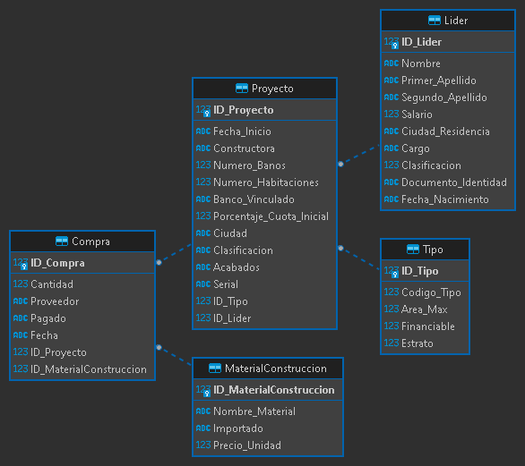

# Ciclo 2. Programación básica - Misión TIC 2022

## Reto 5

Requerimiento construcción de una aplicación de escritorio para la extracción de información y la generación de informes.

### Descripción del problema

¡Apreciado tripulante!, el Ministerio de vivienda requiere que usted realice una aplicación de escritorio que extraiga la información de una base de datos y genere los informes solicitados por los funcionarios del ministerio.

### Aspectos a tener en cuenta

¡Tripulante! debe crear una aplicación de escritorio, que muestre los resultados de las consultas de información solicitadas por el ministerio. Esta aplicación debe contar con una interfaz gráfica de usuario (GUI) y generar los informes requeridos por los funcionarios de dicha institución.

La estructura de la base de datos se presenta a continuación:

<br>
<p align="center">
  
</p>

### Información requerida

Para la creación de los informes, se debe tener en cuenta:

1. **Primer informe**. Generar un informe basándose en la tabla con la información respectiva al “Líder”. El listado debe contener: el ID_Lider, el Nombre, el Primer_Apellido y la Ciudad_Residencia. Este informe debe estar ordenado por la “Ciudad_Residencia” de forma alfabética.

2. **Segundo informe**. Realizar un informe basándose en la información de los proyectos cuya clasificación sea “Casa Campestre” y que estén ubicados en las ciudades de “Santa Marta”, “Cartagena” y “Barranquilla”. Este informe debe contener: el ID_Proyecto, la Constructora, el Nùmero_Habitaciones y la respectiva Ciudad.

3. **Tercer informe**. Realizar un informe basándose en las compras realizadas por los proyectos con el proveedor “Homecenter” y para la ciudad “Salento”. Este informe debe incluir: ID_Compra, Constructora y Banco_Vinculado.

### Consultas SQL realizadas

``` sql
SELECT ID_Lider AS ID, Nombre, Primer_Apellido, Ciudad_Residencia
FROM Lider
ORDER BY Ciudad_Residencia;
```

``` sql
SELECT ID_Proyecto AS ID, Constructora, Numero_Habitaciones, Ciudad
FROM Proyecto p 
WHERE (p.Clasificacion='Casa Campestre' AND (p.Ciudad='Santa Marta' OR p.Ciudad='Cartagena' OR p.Ciudad='Barranquilla'));
```

``` sql
SELECT c.ID_Compra AS ID, p.Constructora, p.Banco_Vinculado 
FROM Compra c
JOIN Proyecto p USING (ID_Proyecto)
WHERE c.Proveedor='Homecenter' AND p.Ciudad='Salento';
```
